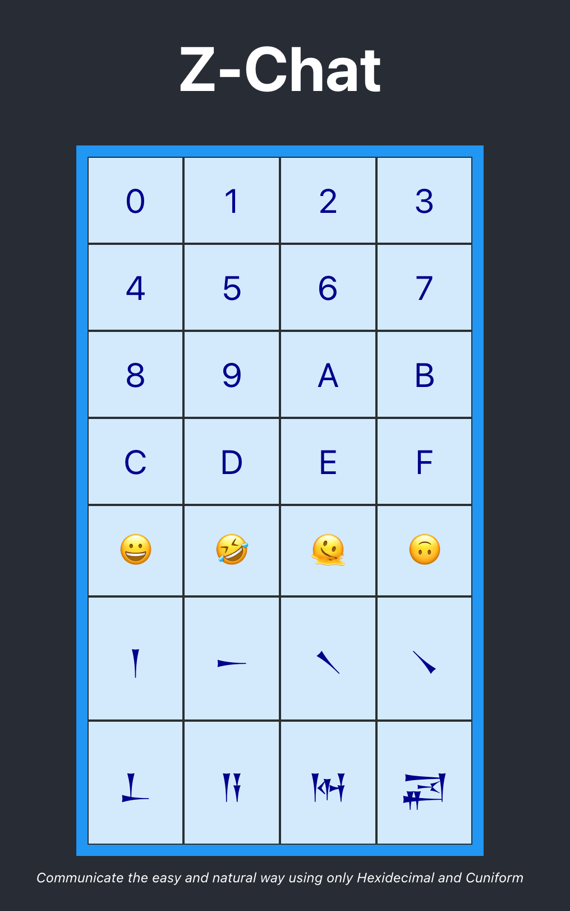

# zchat
Experiment using the eventSource API to do realtime comms with web clients, without the need for websockets



Click on any Cuniform (or Emoji) to transmit the data for that code.

Click on any PAIR of Hexidecimal values to combine them and transmit the character for that combined code.

Click 00 to reset the chat, and start a fresh new chat.

for example - if you Click 4 8 6 9

This will transmit 2 letters - 48 (H) and 69 (i)
Which will print "Hi"

What could be easier ?

# Code 

This code is split into 2 components :

1 - The Zig server, which is mananged by the build.zig file, with the code in the src/ directory

2 - The UI, which is a simple React app using https://github.com/robtaussig/react-use-websocket

# How it works

The React App is served from the Zig server, and presents a simple chat window + some state buttons 
to toggle world state.

When the web user submits changes, these are sent to the Zig server via a standard HTTP POST request.

The react client also creates a persisent connection to the server using the eventSource API
 https://developer.mozilla.org/en-US/docs/Web/API/EventSource

This just waits for incoming messages from the server, and then acts on them as they come in. Simple !

At the server end, it runs a standard web server based on https://github.com/karlseguin/http.zig

(NOTE - actually, this needs some hacks to get it working with event-stream, so its using this branch here
https://github.com/zigster64/http.zig - branch "event-source")

Basic HTTP GET requests are used to serve up the react app

Basic HTTP POST requests are used to "send messages" or other updates

A simple HTTP GET request using the eventSource API is used to communicate state changes from the server back to the client in realtime.

Just straight HTTP, and a bit of multitasking at the server end using `std.Thread`

No websockets needed

# Gitting and Building 

Install Zig - https://ziglang.org/download/

This repo uses Zig master (currently 0.11.0-dev...)


To download the code

```
git clone https://github.com/zigster64/zchat.git
cd zchat
```

To build the server (this repo uses the built-in Zig package manager, so it auto pulls in dependenices)

`zig build`


To build the React app (using npm)

```
cd ui
npm install
npm run build
```

Alternative - use bun to build the react app !

```
cd ui
bun install
bun run build
```

Then, once both the server and the react app are built, do the following to run the server :

`./zig-out/bin/zchat`

or `zig build run` works as well.

This will spawn the server on http://localhost:3000

Now point a couple of browser tabs at that address, and behold - realtime messaging !

# What is the web client doing here ?

The web client makes a persistent connect to GET http://localhost:3000/events
which is an endpoint of mime type `text/event-stream`

This is a text protocol that packages messages in the format
```
event: name of event
data: Some UTF-8 encoded data.
Can be anything - can be TEXT, can be JSON 
can be protobuf encoded if you want !
Finish up with 2 blank lines to denote end of message.

 
```
Note the 2x blank lines to denote the end of the message frame (just like all the other HTTP protocols)

The connection is held open at the end of the message, and the client is expected to wait around till the next 
message arrives.

If the connection is dropped, then you need to handle that yourself. Is easy enough. The EventSource protocol does
not define transport layer behaviour such as reconnection policies. Its just a simple streaming text format.

Thats a 2 second intro ... and its really that simple.  The full spec for the protocol is here :
https://html.spec.whatwg.org/multipage/server-sent-events.html#server-sent-events

Then using the hooks provided in the https://github.com/robtaussig/react-use-websocket package,
the react app simply listens for events and then acts on them as new events come in.

Its basically using webWorkers to run a "event listener thread" in the browser. Sounds complicated,
but as you can see, the code is really simple.

# What is the Server doing ?

Server is pretty simple to.

Uses standard threads to implement the following : 

- Implement a single instance of a "World State" 
- In the main thread, implement a web server to listen for GET requests, and serve up static data
- Add a POST handler to accept updates from web clients, and update the world state
- Add a GET handler for /events - if seen, spawn a new thread that sends the current world state, and then waits for the next event
- When the world state changes, use `std.Thread.Condition.broadcast()` to signal all event threads to send the next update to connected clients

# Great, now what ?   How to can use this and profit ?

The last thing the world needs is another chat application, in this hyper-connected world of ours.

Get off the computer, and go play with the dog, do some home cooking, or ride some bike trails in the forest instead. Thank me later.

In the meantime ... this repo may be useful if you like doing some Zig coding, and want to see how the eventSource API 
might be good fit for web realtime updates instead of assuming that you need to do websockets every time.

Main difference is that websockets are a 2-way persistent connection between client and server.

EventSources are just a 1-way stream of updates from the server to the client.

EventSounces are much easier to code up a state updater compared to websockets.

EventSources do not automatically handle re-connection logic, or other sorcercy without additional code ... its just an event stream. 

WebSockets are great, but it may be overkill for a lot of use cases ?
