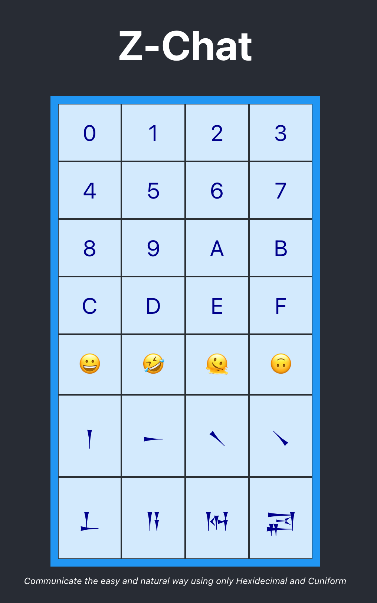

# Z-Chat React App

Communicate the easy and natural way, using only Hexidecimal and Cuniform

People have been communicating using only Cuniform for thousands of centuries, and they have got on just fine.

They managed to build a complete civilization using just cuniform even !

Z-Chat allows you to communicate with other people using Cuniform, with the modern convenience of 
hexidecimal, and some extra emojis for good measure.



Click on any Cuniform (or Emoji) to transmit the data for that code.

Click on any PAIR of Hexidecimal values to combine them and transmit the character for that combined code.

for example - if you Click 4 8 6 9

This will transmit 2 letters - 48 (H) and 69 (i)
Which will print "Hi"

What could be easier ?

# How to build

If you want to go all in on Zig, then install `bun`  `http://bun.sh`

```
# curl -fsSL https://bun.sh/install | bash
```

Then in this directory

```
bun i
bun make build
```

Thats it ! that will pull in all the Javascript dependencies, and then build a bundled React app ready for production.

Have a look in the `build` directory to see the build artifacts.

# How to run

Once the frontend is built, you can then run the Z-Chat server in the main directory

```
zig build run
```

This builds and runs the Z-Chat server.

(NOTE - requires AT LEAST Zig version 0.11.0-dev.3739+939e4d81e ... because so much has changed since last week !)

Once the Z-Chat server is running, then fire up some browsers and point to 
http://localhost:3000

# Debugging

Under Chrome - open up dev tools, and have a look at the network tab.

Notice there is an "event" endpoint that gets hit.

Click through on that, and you will notice something different - its not a normal REST call, its an event-stream.

The request stays open, and you can see individual messages being appended to the event-stream, similar to the way that chrome shows Websocket packets.

Nice !

Under Safari - its a bit different. Open the "sources" tab, and see the "event" source.

It shows complete frames, including the keepalive pings.

Nice !

# SHow me the FrontEnd code

The entire App is encoded in the `App.js` file - with a bit of CSS pretty ups in the `App.css` file.

Its < 100 lines of react code ... if you are not into Frontend code, thats cool, just read it anyway to see how it works.


